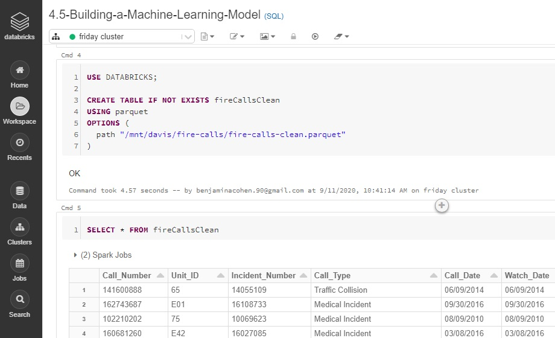
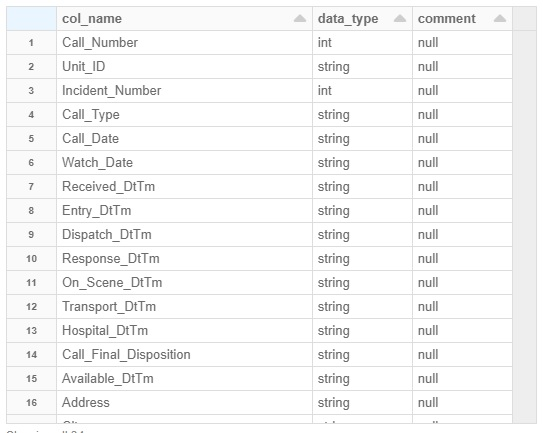

welcome to my machine learning and all-around programming portfolio! here i hope to share the programming work that i have done, either as part of jobs i've had, or in my free time as hobby projects. the intent is to share my skills, receieve commentary from others on how to improve my coding and my analysis insights, and to display my capabilities to future employers. 

the first project, which is named sfpd_fireCalls explores a dataset made from all the calls made into the san francisco fire department between August 2004 and June 2020. the exploration into this dataset will be guided at first by steps taken in an online learning course i took from UC Davis, which covered distributed computing using Databricks and a bit of machine learning. i will then divert from the course and explore the dataset deeper, presenting my own analysis and insights.

# Introduction

this course, which was called "SQL for data science" was good, but a better name probably would have been "distributed computing and relational databasing". the first half was all basic SQL, and the next quarter was all about how to use Databricks, which is a browser-based client-side software that handles distributed computing cluster creation and interaction via Apache Spark. it was great to learn this and i know it will be very helpful in the future. but more on this later. all we need to cover for now is that the primary way to interact with the software is through "notebooks", much like ipynb-style Jupyter notebooks. except that instead of running against a kernel somewhere, they are run against a cluster which is created elsewhere in the software. the cool thing is that the user can easily move through languages, which is how it is done in the course. the course basically compiles data in SQL, and analyzes it in python, which is a pretty standard workflow and what we will do here.

# data import ( parallel to course content)

the course takes place entirely in a databricks notebook. so keep that in mind when reading some of the code below, especially the %magic commands. 



the source of the data is this: https://data.sfgov.org/Public-Safety/Fire-Department-Calls-for-Service/nuek-vuh3/data
the website has a great interface that allows you to interact with the data any way you want. but in the course, the instructors went ahead and downloaded some samples from this dataset (around 800k records) and converted it to a parquet file. a parquet file is an open source file format for Hadoop. Parquet stores nested data structures in a flat columnar format. Compared to a traditional approach where data is stored in row-oriented approach. this makes it more efficient to store and access, which is welcome for a dataset of 800k samples. the Databricks environment has a good set of tools to make this conversion. and this is the starting point of the analysis.

the the default language for this databricks notebook is set to SQL. and the path shown is a location on the cluster (which was set up earlier) where the parquet file is stored.
```
USE DATABRICKS;

CREATE TABLE IF NOT EXISTS fireCallsClean
USING parquet
OPTIONS (
  path "/mnt/davis/fire-calls/fire-calls-clean.parquet"
)
```

first let's take a look at the schema of the data, and the first few rows
	
```
DESCRIBE fireCallsClean
```



lots of good looking fields here.
the course then makes the decision of what the model will predict. we decide we are going to predict the "time delay", which is "Response time - received time". interesting choice. i disagree with that name, as it implies that something is happening later than it should, or that something is being intentionally delayed. but really we are trying to predict the amount of time it will take for the first responders to show up after a call has been made. given how many timestamp fields are logged, we can see that there are a few days to interpret this. we could take the difference of "dispatch_dttm" and "on_scene_dttm" and call it "travel time" (ie, how long the vehicles took to drive from the fire house to the incident). i guess a more encompassing definition could be the difference between the "dispatch time" and the "response time". maybe implying that there is some time between when the firefighters geographically arrive on scene, and when begin formaly "Responding" to the incident. then there's the difference between "received" and "dispatched". implying that there's some time between when the dispatcher receives the call, and when the vehicles leave the firehouse. this could be an interesting thing to track too. and more on that later. but for now, the course has decided to focus on "timeDelay" as being the time between "received" and "responded". which is probably the most encompassing definition. but later on, i will rename this field "response duration". and it will become our target variable (ie the thing we are trying to predict).

so with this as our starting point, we can create the "timeDelay" column in the dataset. which involves first converting the relevant fields and then doing the subtraction.

```
CREATE OR REPLACE VIEW time AS (
  SELECT *, unix_timestamp(Response_DtTm, "MM/dd/yyyy hh:mm:ss a") as ResponseTime, 
            unix_timestamp(Received_DtTm, "MM/dd/yyyy hh:mm:ss a") as ReceivedTime
  FROM fireCallsClean
)
CREATE OR REPLACE VIEW timeDelay AS (
  SELECT *, (ResponseTime - ReceivedTime)/60 as timeDelay
  FROM time
)
```

next, the course goes on to convert this to a Pandas Dataframe so we can clean and analyze it. this is my favourite platform for data analsyis, so i agree with the step. let's do it. keep in mind that the default language of this notebook is SQL, so we have to tell it that we're writing python now. hence the %python magic command at the top

```
%python
spark.conf.set("spark.sql.execution.arrow.enabled", "true")

pdDF = sql("""SELECT timeDelay, Call_Type, Fire_Prevention_District, `Neighborhooods_-_Analysis_Boundaries`, Number_of_Alarms, Original_Priority, Unit_Type
              FROM timeDelay 
              WHERE timeDelay < 15 AND timeDelay > 0""").toPandas()


			  
```

now that we have our data in a pandas dataframe, we can get familiar with it through visualizations, do some cleaning on it, and start our model. that work is done in the .ipynb notebook called "analysis.ipynb". so i encourge you to look at that notebook to continue following along. in that notebook, i do a little bit of following the course content, but the majority of it will diverge. see you there.
[data visualization, cleaning, and machine learning model development](analysis.md)

## alternate method of data import (using SodaPy)

up until now, we have been following how the course imports the data, using a pre-made parquet file which exists in the databricks notebook that comes with the course. so ideally to operate on it, and to use the cluster resources that Databricks provides, we would have to do our analysis/model development in that notebook. but i am more comfortable doing that in an IDE (spyder is my choice). but that would mean i'd have to use my own PC's computing resources. there does exist a way to connect to a databricks notebook from a local IDE but unfortunately the functionality does not extend to the community edition of databricks. so i can't do that. also, my laptop specs and internet speeds are mediocre at best. so i don't want to download a csv from the source and work on that. luckily, the data hosted by dataSF.com has a convenient API we can use to interact with the data. it's called SODA and it has a python interface called Sodapy. take a look at the notebook dataImport.ipynb to see how i use SodaPy to get the same data as the parquet file provided by the course, but directly from the source to a pandas dataframe.
[alternate data import using Sodapy](dataImport.md)


