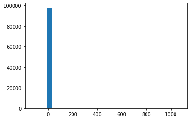
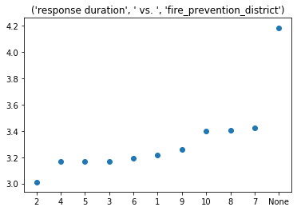

first, let's import all packages needed for this section. Socrata is the library for using sodapy, which will connect us to the data source


```python
import pandas as pd
from sodapy import Socrata
import datetime
import matplotlib.pyplot as plt
import numpy as np
```

set up connection to data source. the app token is associated with an individual user's application, so mine is hidden. but they are free to obtain via data sfdata

the ID for the "fire-department-calls-for-service" dataset is 'nuek-vuh3' whihc sets up a connection to that dataset specifically


```python
domain = 'data.sfgov.org'
app_token = 'XXXXXXXXXX'
```


```python
client = Socrata("data.sfgov.org", app_token, timeout = 30)
dataset = 'nuek-vuh3'
```

let's start by making sure we're in the right place. we can obtain the metadata for the dataset using the get_metadata() method. then store the names of all the fields in a list, so we can pick for them later


```python

metadata = client.get_metadata(dataset)
columns = metadata.get('columns')
fieldNames = [col['fieldName'] for col in columns]
fieldNames
```


    ['call_number',
     'unit_id',
     'incident_number',
     'call_type',
     'call_date',
     'watch_date',
     'received_dttm',
     'entry_dttm',
     'dispatch_dttm',
     'response_dttm',
     'on_scene_dttm',
     'transport_dttm',
     'hospital_dttm',
     'call_final_disposition',
     'available_dttm',
     'address',
     'city',
     'zipcode_of_incident',
     'battalion',
     'station_area',
     'box',
     'original_priority',
     'priority',
     'final_priority',
     'als_unit',
     'call_type_group',
     'number_of_alarms',
     'unit_type',
     'unit_sequence_in_call_dispatch',
     'fire_prevention_district',
     'supervisor_district',
     'neighborhoods_analysis_boundaries',
     'location',
     'rowid',
     ':@computed_region_rxqg_mtj9',
     ':@computed_region_yftq_j783',
     ':@computed_region_jx4q_fizf',
     ':@computed_region_ajp5_b2md',
     ':@computed_region_bh8s_q3mv',
     ':@computed_region_fyvs_ahh9',
     ':@computed_region_p5aj_wyqh',
     ':@computed_region_n4xg_c4py',
     ':@computed_region_fcz8_est8',
     ':@computed_region_h4ep_8xdi']


fortunately/unfortunately, the API only lets a free user obtain 1000 per call. so in order to get all the data we want, we will need to make several calls and store the results in a list. we know we're going to need to do this a few times, so let's write a quick function for it. 


```python
def getAll(domain, app_token, dataset,fieldList,limit):
    
    client = Socrata(domain, app_token, timeout = 30)    
    results = list()
    
    for i in range(limit):        
        incoming = client.get(dataset, select = fieldList, offset = i*1000)
        results.append(incoming)
       
        if len(incoming)<1000:
            break
        pctComplete = 100* (len(results)/limit)
        if pctComplete % 10==0:
            print('percent complete :',pctComplete,  ' %')
            
    return results
```

to get it working, let's define a fieldList and run it. recall that the list of fields we are selecting matches the list of fields that the course has chosen as the ones most pertinent to making predictions of response time.


```python
fieldList = 'received_dttm, dispatch_dttm, response_dttm, call_Type, fire_prevention_district, neighborhoods_analysis_boundaries, number_of_alarms, original_priority, priority, unit_type, rowid'
```


```python
results = getAll(domain,app_token,dataset,fieldList,limit=100)
```

    percent complete : 10.0  %
    percent complete : 20.0  %
    percent complete : 30.0  %
    percent complete : 40.0  %
    percent complete : 50.0  %
    percent complete : 60.0  %
    percent complete : 70.0  %
    percent complete : 80.0  %
    percent complete : 90.0  %
    percent complete : 100.0  %
    

inconveniently, the results are stored in a list, with each element being a JSON string with 1000 records in it. so we need a function to loop through that and make a dataframe out of all the records


```python
def jsonToDF(json_results):
    results_df = pd.DataFrame()
    for i in range(len(json_results)):
        
        results_df= results_df.append(pd.DataFrame.from_records(json_results[i]), sort = False)
    return results_df
            
```


```python
results_df = jsonToDF(results) 
results_df
```


<div>
<style scoped>
    .dataframe tbody tr th:only-of-type {
        vertical-align: middle;
    }

    .dataframe tbody tr th {
        vertical-align: top;
    }

    .dataframe thead th {
        text-align: right;
    }
</style>
<table border="1" class="dataframe">
  <thead>
    <tr style="text-align: right;">
      <th></th>
      <th>received_dttm</th>
      <th>dispatch_dttm</th>
      <th>response_dttm</th>
      <th>call_Type</th>
      <th>fire_prevention_district</th>
      <th>neighborhoods_analysis_boundaries</th>
      <th>number_of_alarms</th>
      <th>original_priority</th>
      <th>priority</th>
      <th>unit_type</th>
      <th>rowid</th>
    </tr>
  </thead>
  <tbody>
    <tr>
      <td>0</td>
      <td>2020-04-19T00:10:45.000</td>
      <td>2020-04-19T00:11:17.000</td>
      <td>2020-04-19T00:11:20.000</td>
      <td>Medical Incident</td>
      <td>2</td>
      <td>Tenderloin</td>
      <td>1</td>
      <td>C</td>
      <td>2</td>
      <td>MEDIC</td>
      <td>201100018-67</td>
    </tr>
    <tr>
      <td>1</td>
      <td>2020-04-19T00:18:37.000</td>
      <td>2020-04-19T00:20:31.000</td>
      <td>2020-04-19T00:20:45.000</td>
      <td>Medical Incident</td>
      <td>2</td>
      <td>Tenderloin</td>
      <td>1</td>
      <td>3</td>
      <td>3</td>
      <td>MEDIC</td>
      <td>201100034-86</td>
    </tr>
    <tr>
      <td>2</td>
      <td>2020-04-19T00:18:37.000</td>
      <td>2020-04-19T00:20:31.000</td>
      <td>2020-04-19T00:20:36.000</td>
      <td>Medical Incident</td>
      <td>2</td>
      <td>Tenderloin</td>
      <td>1</td>
      <td>3</td>
      <td>3</td>
      <td>SUPPORT</td>
      <td>201100034-QRV1</td>
    </tr>
    <tr>
      <td>3</td>
      <td>2020-04-19T00:24:45.000</td>
      <td>2020-04-19T00:29:54.000</td>
      <td>2020-04-19T00:31:50.000</td>
      <td>Traffic Collision</td>
      <td>9</td>
      <td>West of Twin Peaks</td>
      <td>1</td>
      <td>3</td>
      <td>3</td>
      <td>ENGINE</td>
      <td>201100053-E19</td>
    </tr>
    <tr>
      <td>4</td>
      <td>2020-04-19T00:24:45.000</td>
      <td>2020-04-19T00:29:54.000</td>
      <td>2020-04-19T00:30:27.000</td>
      <td>Traffic Collision</td>
      <td>9</td>
      <td>West of Twin Peaks</td>
      <td>1</td>
      <td>3</td>
      <td>3</td>
      <td>PRIVATE</td>
      <td>201100053-KM07</td>
    </tr>
    <tr>
      <td>...</td>
      <td>...</td>
      <td>...</td>
      <td>...</td>
      <td>...</td>
      <td>...</td>
      <td>...</td>
      <td>...</td>
      <td>...</td>
      <td>...</td>
      <td>...</td>
      <td>...</td>
    </tr>
    <tr>
      <td>995</td>
      <td>2019-12-13T12:39:47.000</td>
      <td>2019-12-13T12:42:33.000</td>
      <td>2019-12-13T12:44:52.000</td>
      <td>Elevator / Escalator Rescue</td>
      <td>9</td>
      <td>West of Twin Peaks</td>
      <td>1</td>
      <td>3</td>
      <td>3</td>
      <td>TRUCK</td>
      <td>193471778-T15</td>
    </tr>
    <tr>
      <td>996</td>
      <td>2019-12-14T12:53:55.000</td>
      <td>2019-12-14T12:57:01.000</td>
      <td>2019-12-14T12:58:10.000</td>
      <td>Medical Incident</td>
      <td>9</td>
      <td>West of Twin Peaks</td>
      <td>1</td>
      <td>2</td>
      <td>2</td>
      <td>ENGINE</td>
      <td>193481776-E33</td>
    </tr>
    <tr>
      <td>997</td>
      <td>2019-10-03T14:54:35.000</td>
      <td>2019-10-03T14:56:15.000</td>
      <td>2019-10-03T14:56:21.000</td>
      <td>Medical Incident</td>
      <td>3</td>
      <td>South of Market</td>
      <td>1</td>
      <td>3</td>
      <td>3</td>
      <td>MEDIC</td>
      <td>192762497-77</td>
    </tr>
    <tr>
      <td>998</td>
      <td>2019-12-18T02:03:23.000</td>
      <td>2019-12-18T02:05:57.000</td>
      <td>2019-12-18T02:07:23.000</td>
      <td>Medical Incident</td>
      <td>4</td>
      <td>Western Addition</td>
      <td>1</td>
      <td>2</td>
      <td>3</td>
      <td>ENGINE</td>
      <td>193520192-E38</td>
    </tr>
    <tr>
      <td>999</td>
      <td>2019-11-30T14:30:41.000</td>
      <td>2019-11-30T14:32:15.000</td>
      <td>2019-11-30T14:34:45.000</td>
      <td>Structure Fire</td>
      <td>9</td>
      <td>Excelsior</td>
      <td>1</td>
      <td>3</td>
      <td>3</td>
      <td>RESCUE SQUAD</td>
      <td>193341675-RS1</td>
    </tr>
  </tbody>
</table>
<p>100000 rows × 11 columns</p>
</div>


because we didn't specify it, pandas assumes string objects for all columns in the dataframe. so now let's explicitly tell it what data type each column should be


```python
dataTypeDict = {'received_dttm':'datetime64',
                'dispatch_dttm':'datetime64',
                'response_dttm':'datetime64',
                'call_Type':'str',
                'fire_prevention_district':'str',
                'neighborhoods_analysis_boundaries':'str',
                'number_of_alarms':'int',
                'original_priority':'str',
                'priority':'str',
                'unit_type':'str'}    
results_df = results_df.astype(dataTypeDict)
```

now we can do some preliminary math on the dataframe to get the target variable. recall that in the course, they called this "timeDelay" and defined it as "response time" - "received time". i have decided to call this "response duration" as i think it is a more descriptive and accurate name for the variable. i'll also calculate a field called "travel time" defined as "dispatch_dttm" - "response_dttm". just for fun. also, pandas will automatically store these as the "timedelta" datatype. which i think would be fine, but for simplicity of the ML model, let's convert them to minutes (as floats)


```python
results_df['response duration'] = results_df['response_dttm'] - results_df['received_dttm']
results_df['response duration'] = results_df['response duration']/np.timedelta64(1,'s')/60
```


```python
results_df['travel time'] = results_df['response_dttm'] - results_df['dispatch_dttm']
results_df['travel time'] = results_df['travel time']/np.timedelta64(1,'s')/60
```


```python
results_df.dtypes
        
```


    received_dttm                        datetime64[ns]
    dispatch_dttm                        datetime64[ns]
    response_dttm                        datetime64[ns]
    call_Type                                    object
    fire_prevention_district                     object
    neighborhoods_analysis_boundaries            object
    number_of_alarms                              int32
    original_priority                            object
    priority                                     object
    unit_type                                    object
    rowid                                        object
    response duration                           float64
    travel time                                 float64
    dtype: object


to get a sense of the distribution of the data we're dealing with, let's have a look at a histogram


```python
plt.hist(results_df['response duration'], bins = 30)
```

    C:\Users\admin\Anaconda3\lib\site-packages\numpy\lib\histograms.py:824: RuntimeWarning: invalid value encountered in greater_equal
      keep = (tmp_a >= first_edge)
    C:\Users\admin\Anaconda3\lib\site-packages\numpy\lib\histograms.py:825: RuntimeWarning: invalid value encountered in less_equal
      keep &= (tmp_a <= last_edge)
    


    (array([4.0000e+00, 0.0000e+00, 0.0000e+00, 9.7425e+04, 3.3000e+02,
            5.2000e+01, 5.0000e+00, 1.0000e+00, 1.0000e+00, 1.0000e+00,
            0.0000e+00, 1.0000e+00, 0.0000e+00, 0.0000e+00, 0.0000e+00,
            0.0000e+00, 0.0000e+00, 1.0000e+00, 0.0000e+00, 0.0000e+00,
            0.0000e+00, 0.0000e+00, 0.0000e+00, 0.0000e+00, 0.0000e+00,
            0.0000e+00, 0.0000e+00, 0.0000e+00, 0.0000e+00, 1.0000e+00]),
     array([-128.2       ,  -88.25388889,  -48.30777778,   -8.36166667,
              31.58444444,   71.53055556,  111.47666667,  151.42277778,
             191.36888889,  231.315     ,  271.26111111,  311.20722222,
             351.15333333,  391.09944444,  431.04555556,  470.99166667,
             510.93777778,  550.88388889,  590.83      ,  630.77611111,
             670.72222222,  710.66833333,  750.61444444,  790.56055556,
             830.50666667,  870.45277778,  910.39888889,  950.345     ,
             990.29111111, 1030.23722222, 1070.18333333]),
     <a list of 30 Patch objects>)





looks like a pretty skewed distribution, with most values between 0 and 20 minutes. and a few much longer. so let's do as the course does and only focus on the values between 0 and 15 minutes, assuming the others are outliers that will hurt more than help our model.

i acknowledge that sometimes outliers are significant and we want our model to be able to learn from the fact that they are there, so i may remove this restriction later.


```python
temp = results_df[results_df['response duration'].between(0,15)]
plt.hist(temp['response duration'], bins = 30)
```


    (array([ 3247.,  5470.,  7538.,  9718., 11865., 12836., 11713.,  9472.,
             6982.,  4825.,  3223.,  2203.,  1590.,  1140.,   785.,   649.,
              516.,   376.,   350.,   291.,   235.,   221.,   174.,   139.,
              143.,   118.,   102.,   113.,    98.,    96.]),
     array([ 0. ,  0.5,  1. ,  1.5,  2. ,  2.5,  3. ,  3.5,  4. ,  4.5,  5. ,
             5.5,  6. ,  6.5,  7. ,  7.5,  8. ,  8.5,  9. ,  9.5, 10. , 10.5,
            11. , 11.5, 12. , 12.5, 13. , 13.5, 14. , 14.5, 15. ]),
     <a list of 30 Patch objects>)





with this filtering applied, we now a very pretty distribution, with a healthy mean right around 3 minutes

this concludes the data import section. we will now store the results_df variable so we can use it in the next notebook, which cleans the data, explores it, and builds the models


```python
%store results_df
```
